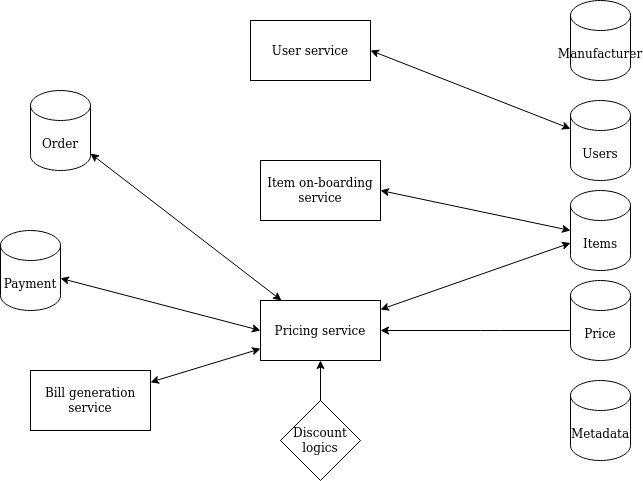

## Kata 01 (Supermarket Problem)

### Constraint
- variable pricing
    - 3 for price of 1
    - discount can apply to one or group of items
    - buy 2 get one free
  - rouding off
 - A more complax version can be tracking the historical price of item
      - **use case** : user comes to return an object, on day of selling the item was as 10$ but when user come to ask for refund the price of item is 12$, so how do we ensure that refunded amount is 10$.
- generation of proper invoice with correct tax deduction and display
- having some way to know payment status, able to retrive past orders.
- logs
  - invoice logs
  - pricing
  - have ability to know daily profilt/loss
  - can support loyalty programs like if user spends 100$ in month then 10 off on next purchase
  
(optional, if we can include these constraint, then it is good)
- stock management (how to ensure if some object is out of stock)


Proposed Solution :

Objects: -

```
public class Item {
    public string ID 
    public Price Price 
    public string MetadataID
    public datetime expirydata
    public datetime buy_date
    public datetime date_of_Entry
}

public class Price {
    public float MRP
    public float CostPrice
}

public class Metadata {
    public string ID
    public string brand
    public string department
    ... // can add more based on requirment
    public int count
}

public class Users {
    public string ID
    public string PhoneNo
    public string (enum) UserType (buyer/seller)
}

public class Manufacturer {
    public string ID
    public string name
    public string address
}

public class Order {
public Item[] Items
public string ID
public string sellerID(FK) from users ID
public string buyerID(FK) from users ID
public datetime booking_date
public bool valid (whether order has been processed/ or still in progress)
}

public class Payment {
public string OrderID (FK to order table)
public string Mode
public float TransactionAmount
public string CurrencyType
public string status (enum, not done, pending with bank, complete, refund)
}

public class Refund {
... (TBD)
}

```

### Services

#### UserService
    Takes phone no for registering user
    CURD operation on user
    Interacts with user DB
    Responsibilities
        Get uuid of user based on phone no
        Return user object based on uuid

#### Item onboarding service
    Curd operation on items
    Interacts with item DB
    Responsibilities 
        Return item details based on item ID

#### Pricing service - 
    Interact with item Table
    Responsibilities-
        Get sale price of item based on item id
        It has to handle cases like when prices vary, example (buy2 , 1free)
        Discounts based on location/time of year/sale etc
        
#### Bill generation service
    Interact with order Table, rPricing service
    Responsibilities
        Return invoice or bill based on order id

---


Few more things which can make problem interesting and increase engginering challenge.

Aspects to consider that might edify: KISS and YAGNI, stakeholder requirements, pricing system dev cost vs. ROI,
product return policies, tax system requirements, i18n, currency granularity and conversion, cultural and industry norms,
fraud detection, forms of payment, 3rd party coupons, forms of POS device, data storage choices,
barter and cashier discretion, and last but very important, ease of system maintenance and modification.




Q - How are we gonna support discount or specifc cases(Buy 2 Get 1 free) ?
A - initially calculate the total price, pricing service then uses the logic to give discounts and creates final bill by calling billing service.

Q - How to retrive price in case of refund?
A - Get Bill details from Billing service and retrive price(to be refunded) from that

Q - How to maintain that stock is not empty?
A - use count field in metadata table, to find no of items currently in stock, see how many items have specific metadataID in items.

#### Learnings

**Open Close Principle**
A class is closed, since it may be compiled, stored in a library, baselined, and used by client classes. But it is also open, since any new class may use it as parent, adding new features. When a descendant class is defined, there is no need to change the original or to disturb its clients.

https://stackify.com/solid-design-open-closed-principle/
https://stackoverflow.com/questions/20677249/why-we-add-underscore-before-variable-name
